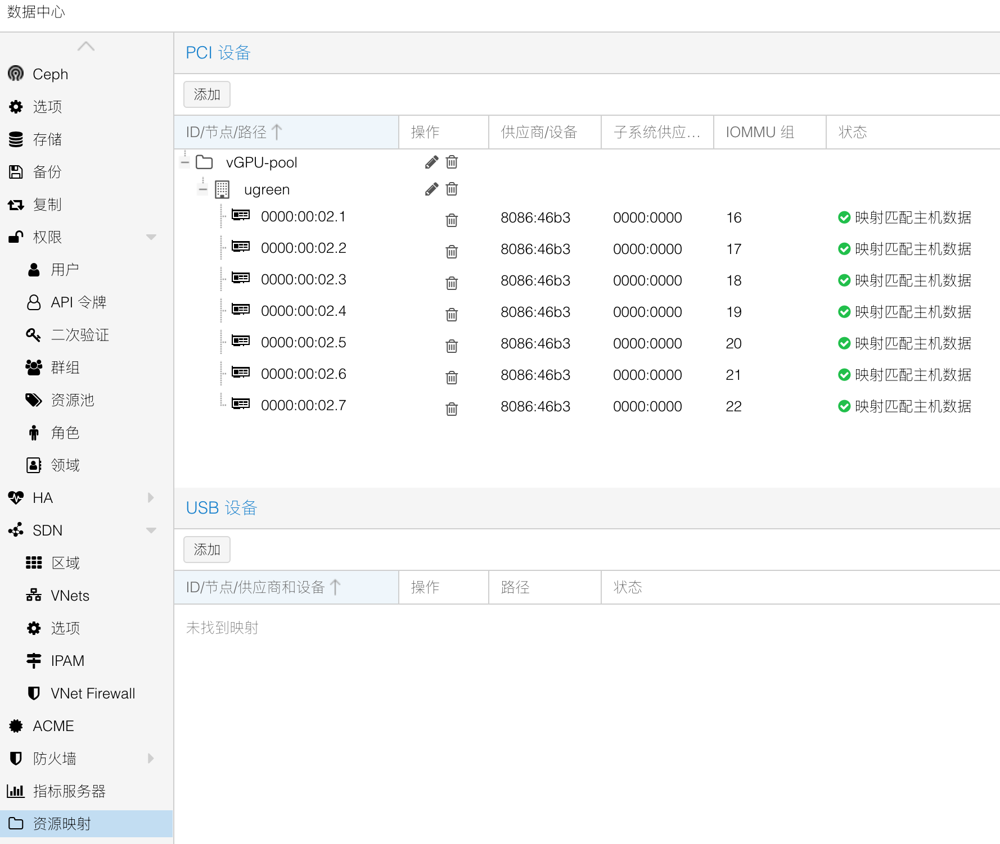

### BIOS调整

- 按ctrl + F2进入BIOS后，再按ctrl + F1打开详细菜单；

- 关闭看门狗，否则3分钟自动重启，注意改完保存退出后再进行BIOS其他配置，否则3分钟到就重启；

- 节能配置打开cpu cstate，设备ASPM：

  参照：[Trying to modify BIOS to lower power consumption : r/UgreenNASync (reddit.com)](https://www.reddit.com/r/UgreenNASync/comments/1e83h8l/trying_to_modify_bios_to_lower_power_consumption/)

  ```bash
  Advanced -> Power & Performance -> CPU - Power Management Control
  C states -> Enabled
  Package C State Limit -> Auto
  
  Advanced -> Power Settings
  Enable ACPI Auto Configuration -> Enabled
  
  Advanced -> PCI Subsystem Settings
  PCI Express Settings
  ASPM Support -> Auto
  
  Chipset -> OnBoard Lan 1 -> Disabled (Disables LAN 1 10GB Interface if not needed, also seems like it doesn't support ASPM)
  
  Chipset -> System Agent Configuration -> PCI Express Configuration
  PCI Express Root Port 1-3
  ASPM -> L0sL1
  
  Chipset -> PCH-IO Configuration
  PCI Express Configuration
  PCI Express Root Port x
  ASPM -> Auto
  ```

  如果用不到双网卡，可以关闭万兆卡来节能

  

### 安装系统

参照文章《PVE文件系统对比，备份和恢复》

### 系统基本配置

- 修改debian系统源

```bash
## 替换系统软件仓库

$ sed -i 's|^deb http://ftp.debian.org|deb https://mirrors.ustc.edu.cn|g' /etc/apt/sources.list

$ sed -i 's|^deb http://security.debian.org|deb https://mirrors.ustc.edu.cn/debian-security|g' /etc/apt/sources.list

```

如果希望能更新 CPU 的 `microcode` ，则需要手动添加镜像 `non-free` 、 `non-free-firmware` 参数，完整系统源示例如下。  

```bash
deb https://mirrors.ustc.edu.cn/debian/ bookworm main contrib non-free non-free-firmware

deb https://mirrors.ustc.edu.cn/debian/ bookworm-updates main contrib non-free non-free-firmware

# security updates
deb https://mirrors.ustc.edu.cn/debian-security/ bookworm-security main contrib non-free non-free-firmware
```

- 修改PVE 软件源

默认情况下，PVE 额外启用了 2 个官方源，且为订阅收费制，因此需要替换为免费源。  

首先创建 PVE 免费软件源，执行以下命令。  

```bash
## 创建 PVE 免费软件源

$ source /etc/os-release

$ echo "deb https://mirrors.ustc.edu.cn/proxmox/debian/pve $VERSION_CODENAME pve-no-subscription" > /etc/apt/sources.list.d/pve-no-subscription.list
```

对于 Proxmox Backup Server 和 Proxmox Mail Gateway，请将以上命令中的 `pve` 分别替换为 `pbs` 和 `pmg` 。  

进一步创建 PVE Ceph 免费软件源，Ceph 软件源为 PVE 8 之后默认安装，执行以下命令。  

```bash
## 创建 PVE Ceph 免费软件源脚本

if [ -f /etc/apt/sources.list.d/ceph.list ]; then
  CEPH_CODENAME=`ceph -v | grep ceph | awk '{print $(NF-1)}'`
  source /etc/os-release
  echo "deb https://mirrors.ustc.edu.cn/proxmox/debian/ceph-$CEPH_CODENAME $VERSION_CODENAME no-subscription" > /etc/apt/sources.list.d/ceph-no-subscription.list
fi
```

最后，删除 PVE 官方付费软件源，执行以下命令。  

**注意：rm 为高风险命令，请正确使用，请勿手抖，请勿手抖。**

```bash
## 删除付费软件源
$ rm -rvf /etc/apt/sources.list.d/pve-enterprise.list /etc/apt/sources.list.d/ceph.list
```

创建完成后对其进行检查。  
- 修改PVE CT 源

如果需要使用 Proxmox 网页端下载 CT Templates ，可替换 CT Templates 源。  

由于该功能暂时未被使用，因此本文只做记录。  

```bash
## 备份 CT Templates 源
$ cp /usr/share/perl5/PVE/APLInfo.pm /usr/share/perl5/PVE/APLInfo.pm.bak

## 替换 CT Templates 链接
$ sed -i 's|http://download.proxmox.com|https://mirrors.ustc.edu.cn/proxmox|g' /usr/share/perl5/PVE/APLInfo.pm

## 重启 PVE API 守护进程
$ systemctl restart pvedaemon.service

## 更新 CT Templates 列表
$ pveam update
```

-	镜像同步

更换完成系统源之后，需要同步系统源数据。  

考虑到 **“离线”** 安装时无法同步系统源，因此该步骤可以等到 PVE 正确连接 Internet 后再执行。  

```bash
## 清理软件包
$ apt clean && apt autoclean && apt autoremove --purge
## 清理系统缓存
$ rm -rvf /var/cache/apt/* /var/lib/apt/lists/* /tmp/*

## 清理系统日志
$ find /var/log/ -type f | xargs rm -rvf

## 清理命令历史记录文件
$ rm -rvf ~/.bash_history && history -c
## 同步软件源
$ apt update

## 更新系统
$ apt full-upgrade
```

- 安装常用包

```bash
$ apt install --no-install-recommends --no-install-suggests btop lm-sensors unzip neovim tmux unattended-upgrades powermgmt-base linux-cpupower intel-microcode git htop s-tui powertop stress build-* dkms proxmox-headers-$(uname -r) proxmox-kernel-$(uname -r) sysfsutils i2c-tools fancontrol 
  
  ## 更新 PCI 数据库
$ update-pciids
```

### 绿联led灯

项目：[miskcoo/ugreen_leds_controller: An LED Controller for UGREEN's DX/DXP NAS Series (github.com)](https://github.com/miskcoo/ugreen_leds_controller)

安装release中的两个deb，cp /etc/ugreen-leds.example.conf /etc/ugreen-leds.conf 然后 /etc/ugreen-leds.conf文件内可以修改配置

安装i2c-tools

```bash
# change enp2s0 to the network device you want to monitor
systemctl start ugreen-netdevmon@enp5s0 
systemctl start ugreen-diskiomon

# if you confirm that everything works well, 
# run the command below to make the service start at boot
systemctl enable ugreen-netdevmon@enp5s0 
systemctl enable ugreen-diskiomon
```

### 硬盘休眠

修改/etc/lvm/lvm.conf文件

```bash
global_filter=["r|/dev/zd.*|","r|/dev/rbd.*|","r|/dev/sd.*|","r|/dev/mapper/vg[0-9]+-.*|","r|/dev/md.*|"]
$ pvestatd stop #为了不停这个，如果挂载的是LVM磁盘（比如群晖的）需要自己做systemctl服务
```

安装[发布 ·adelolmo/hd-idle (github.com)](https://github.com/adelolmo/hd-idle)

修改配置文件/etc/default/hd-idle

```bash
START_HD_IDLE=true
HD_IDLE_OPTS="-i 0 -a sda -i 1200 -a sdb -i 1200 -l /var/log/hd-idle.log"
```

```bash
# systemctl start hd-idle
# systemctl enable hd-idle
```

**开机服务**

在`/etc/systemd/system`下新建服务：

`lvm_scan_pre.service`

```bash
[Unit]
Description=Run lvm_scan.sh pre early in boot process
Before=local-fs-pre.target
DefaultDependencies=no
Conflicts=shutdown.target
Wants=local-fs-pre.target

[Service]
Type=oneshot
ExecStart=/usr/local/bin/lvm_scan.sh pre

[Install]
WantedBy=local-fs-pre.target
```

`lvm_scan_post.service`

```bash
[Unit]
Description=Run lvm_scan.sh post after system startup
After=multi-user.target

[Service]
Type=oneshot
ExecStart=/usr/local/bin/lvm_scan.sh post

[Install]
WantedBy=multi-user.target
```

创建脚本`/usr/local/bin/lvm_scan.sh`

```bash
#!/bin/bash

LVM_CONF="/etc/lvm/lvm.conf"

# 转义特殊字符用于 grep
escape_grep() {
    echo "$1" | sed -e 's/[|]/\\|/g'
}

# 添加规则到 global_filter
add_filter() {
    local filter
    filter=$(escape_grep "$1")
    if ! grep -qE "^[^#]*$filter" "$LVM_CONF"; then
        echo "Adding '$1' to global_filter..."
	sed -i "/^[^#]*global_filter/ s@]@, \"$1\"]@" "$LVM_CONF"
    else
        echo "'$1' is already present."
    fi
}

# 从 global_filter 移除规则
remove_filter() {
    local filter
    filter=$(escape_grep "$1")
    if grep -qE "^[^#]*$filter" "$LVM_CONF"; then
        echo "Removing '$1' from global_filter..."
        #sed -i "/^[^#]*global_filter/ s/, \"$1\"//" "$LVM_CONF"
	escaped_filter=$(echo "$1" | sed 's/[][\/.^$*]/\\&/g')  # 转义特殊字符
        sed -i "/^[^#]*global_filter/ s/, \"$escaped_filter\"//" "$LVM_CONF"
    else
        echo "'$1' is already absent."
    fi
}

# 检查是否有挂载的 VG
vgs_mounted() {
    grep -q "^/dev/mapper/.*-volume_" /etc/mtab
}

case "$1" in
    pre)
        echo "Executing pre-scan adjustments..."
        if ! vgs_mounted; then
            remove_filter "r|/dev/sd.*|"
            remove_filter "r|/dev/md.*|"
            remove_filter "r|/dev/mapper/vg.*|"
        else
            echo "VGs are already mounted. Skipping adjustments."
        fi
        ;;
    post)
        echo "Executing post-scan adjustments..."
        add_filter "r|/dev/sd.*|"
        add_filter "r|/dev/md.*|"
        add_filter "r|/dev/mapper/vg.*|"
        ;;
    *)
        echo "Usage: $0 {pre|post}"
        exit 1
        ;;
esac
```
**启动服务**

```bash
sudo systemctl enable lvm_scan_pre.service
sudo systemctl enable lvm_scan_post.service
sudo systemctl start lvm_scan_pre.service
sudo systemctl start lvm_scan_post.service
journalctl -u lvm_scan_pre.service
journalctl -u lvm_scan_post.service
```


### 风扇调速

1. 安装it87驱动：https://github.com/frankcrawford/it8 `clone && make dkms`

   或者下载[畅网大佬](https://bbs.x86pi.cn/thread?topicId=20)的[①(it87 系列传感器驱动，显示 PVE 风扇转速)：IT87传感器驱动_it87-dkms_1.0.63-1_all.deb](https://bbs.x86pi.cn/file/topic/2023-12-03/file/5434427fbfde4da7a71e654c3d178d17b2.deb)

2. 开机加载驱动

   ```bash
   ##编辑/etc/modules，加入
   coretemp
   drivetemp
   ```

3. 用pwmconfig生成：/etc/fancontrol

   ```bash
   # Configuration file generated by pwmconfig, changes will be lost
   INTERVAL=10
   
   DEVPATH=hwmon3=devices/platform/it87.2608 hwmon4=devices/platform/coretemp.0
   DEVNAME=hwmon3=it8613 hwmon4=coretemp
   
   FCTEMPS=hwmon3/pwm2=hwmon4/temp1_input hwmon3/pwm3=/var/run/hwmon_fake/hwmon0/temp1_input
   FCFANS=hwmon3/pwm2=hwmon3/fan2_input hwmon3/pwm3=hwmon3/fan3_input
   
   MINTEMP=hwmon3/pwm2=25 hwmon3/pwm3=30
   MAXTEMP=hwmon3/pwm2=80 hwmon3/pwm3=45
   
   MINSTART=hwmon3/pwm2=82 hwmon3/pwm3=50
   MINSTOP=hwmon3/pwm2=22 hwmon3/pwm3=30
   
   MINPWM=hwmon3/pwm2=22 hwmon3/pwm3=30
   ```

   此处我用了`fake hwmon`来把所有硬盘的最高温度告知`fancontrol`，同样需要systemctl服务：

   新建`fake_temp_fs.service`

   ```bash
   [Unit]
   Description=Setup fake temperature file system
   Before=fancontrol.service
   DefaultDependencies=no
   Conflicts=shutdown.target
   After=local-fs.target
   
   [Service]
   Type=oneshot
   ExecStart=/usr/local/bin/aggregate_temp.sh
   ```

   新建定时器`fake_temp_fs.timer`

   ```bash
   [Unit]
   Description=Run fake_temp_fs.service every 10 seconds
   Before=fancontrol.service
   
   [Timer]
   OnBootSec=0
   OnUnitActiveSec=10s
   
   [Install]
   WantedBy=multi-user.target
   ```

   ```bash
   $ sudo systemctl daemon-reload
   $ sudo systemctl enable fake_temp_fs.service
   $ systemctl enable fake_temp_fs.timer
   $ systemctl start fake_temp_fs.timer
   $ systemctl list-timers --all
   $ systemctl list-dependencies fancontrol.service
   ## 生成的 boot.svg 文件中会显示所有服务的启动顺序
   $ systemd-analyze plot > boot.svg
   ## 模拟开机测试
   $ journalctl -b | grep -E "fake_temp_fs|fancontrol"
   
   ```

### 硬盘挂载

- 我运行的模式是双系统：sd卡装RR引导群晖，同时绿联自带的m2刷了pve系统，另外添加1t的m2做数据盘，存放虚拟机虚拟磁盘和运行所需文件；

- 经过测试，群晖7.0以下创建的btrfs格式磁盘挂载不上，可能和系统btrfs版本过高有关，群晖官方建议要用老版本内核；该用7.0系统重建后挂载没问题，特别系统盘（装套件的盘）用btrfs似乎还是会报一些错，所以又改成了ext4格式；

- 群晖7.0后的磁盘采用了LVM：

  - 使用`lsblk -f`获取uuid
  
      ```
      NAME                            FSTYPE            FSVER    LABEL                      UUID                                   FSAVAIL FSUSE% MOUNTPOINTS
      sda
      ├─sda1                          linux_raid_member 1.2      SynologyNAS:0              60957d6e-92de-76ab-b078-5a75ed8e6bc4
      │ └─md0                         ext4              1.0      1.44.1-72806               ed5d6969-8f61-48d0-87c6-e7d27d29bc34
      ├─sda2                          linux_raid_member 1.2      SynologyNAS:1              e24e0edb-3703-8a1b-5d10-0e907e9cf556
      │ └─md1                         swap              1                                   8fe6046e-f334-4706-aed7-8c0ec5624916
      └─sda3                          linux_raid_member 1.2      sa6400:2                   870f99e8-4f5b-878d-caa6-8e0ac1736357
        └─md2                         LVM2_member       LVM2 001                            daijlv-jUKo-wryc-4YLq-dvXR-guRy-AuyyQr
          ├─vg3-syno_vg_reserved_area
          └─vg3-volume_1              ext4              1.0      1.44.1-72806               806f03f3-e970-4539-9dd4-98ea8ad9011d  
      ```
  
  - 配置`/etc/fstab`开机自动挂载
  
    ```
    # <file system> <mount point> <type> <options> <dump> <pass>
    proc /proc proc defaults 0 0
    UUID=806f03f3-e970-4539-9dd4-98ea8ad9011d /mnt/volume1 ext4  defaults,nofail 0 0
    UUID=4a32bac0-c8ed-4a2b-9541-5eb3e5caa47a /mnt/volume2 ext4  defaults,nofail 0 0
    UUID=25f86ee0-c988-40dc-9665-79fabd97d905 /mnt/volume3 btrfs defaults,nofail 0 0
    UUID=4de05f4d-014a-4d71-9d2d-bf3cabca7758 /mnt/volume4 btrfs defaults,nofail 0 0
    ```
  
  - 还有一个问题，由于我的磁盘有些是RR下创建，有些是群晖NAS下创建的，混装拿到一起的时候存在md编号冲突，pve的mdadm会识别成一样的，这样会导致某些磁盘无法挂载，其实是被其他磁盘抢占了编号；
  
      - 查看 `mdadm` 的配置文件 `/etc/mdadm/mdadm.conf` 是否有重复的阵列定义：
  
          ```bash
          cat /etc/mdadm/mdadm.conf
          ```
  
          如果发现重复的阵列条目，例如：
  
          ```plaintext
          ARRAY /dev/md/5 UUID=b2b40ae7:ffd083c4:ff01ee04:c8c20a37
          ARRAY /dev/md/5 UUID=3c7d47dc:9ebe7a18:7d866bd5:087fa516
          ```
  
          将其中一个条目删除，或为冲突阵列分配新的设备名称（例如 `/dev/md/6`）：
  
          ```plaintext
          ARRAY /dev/md/6 UUID=3c7d47dc:9ebe7a18:7d866bd5:087fa516
          ```
  
          保存后，重新加载配置：
  
          ```bash
          mdadm --assemble --scan
          ```
  
- 磁盘直通给lxc容器

  ```
  pct set 100 -mp0 /mnt/volume1,mp=/volume1
  或者
  pct set 100 -mp0 /dev/disk/by-uuid/806f03f3-e970-4539-9dd4-98ea8ad9011d,mp=/volume1
  ```

  

### 核显SR-IOV

- 官网[strongtz/i915-sriov-dkms: dkms module of Linux i915 driver with SR-IOV support (github.com)](https://github.com/strongtz/i915-sriov-dkms)

  ```bash
  ## 安装一些必须的如build-* dkms proxmox-headers-6.8.8-2-pve proxmox-kernel-6.8.8-2-pve, 上面系统配置部分已经安装
  $ git clone https://github.com/strongtz/i915-sriov-dkms
  $ cd i915-sriov-dkms && dkms add .
  $ dkms install -m i915-sriov-dkms -v $(cat VERSION) --force
  ```
  ```bash
  echo "devices/pci0000:00/0000:00:02.0/sriov_numvfs = 7" > /etc/sysfs.conf
  ```
  
  添加内核启动参数：
  
  - `/etc/default/grub`（ext4/xfs的情况）
  
    ```bash
    GRUB_CMDLINE_LINUX_DEFAULT+=intel_iommu=on i915.enable_guc=3 i915.max_vfs=7
    ```
  
    执行`update-grub`和`update-initramfs`
  
  - `/etc/kernel/cmdline`（zfs）加入参数
  
    ```bash
    root=ZFS=rpool/ROOT/pve-1 boot=zfs intel_iommu=on i915.enable_guc=3 i915.max_vfs=7
    ```
    执行`proxmox-boot-tool refresh`
  
  重启lspci应该可以看到多出来几张VGA设备，注意给虚拟机直通的时候不能直通02:00.0主设备，也就是不要勾选`全部功能`。
  
- **SR-IOV启用后dmesg报错版本不匹配问题**

  `dmesg`报错：

  ```bash
  [    5.593081] i915 0000:00:02.3: Running in SR-IOV VF mode
  [    5.593390] i915 0000:00:02.3: [drm] *ERROR* GT0: IOV: Unable to confirm version 1.13 (0000000000000000)
  [    5.593432] i915 0000:00:02.3: [drm] *ERROR* GT0: IOV: Found interface version 0.1.13.4
  ```

  此时需要修改i915-sriov-dkms源码的Makefile，源码安装，9改成13（按照dmesg里报错的1.13改）,https://github.com/strongtz/i915-sriov-dkms/issues/186#issuecomment-2254512671

  ```bash
  sed -i 's/GUCFIRMWARE_MINOR:-9/GUCFIRMWARE_MINOR:-13/' Makefile
  rm -rf /usr/src/i915-sriov-dkms-* /var/lib/dkms/i915-sriov-dkms
  dkms add .
  dkms install -m i915-sriov-dkms -v $(cat VERSION) -k $(uname -r) --force
  update-grub && update-initramfs -u
  reboot
  ```
  查看firmware版本是否和i915固件匹配

  ```bash
  $ apt policy pve-firmware
  pve-firmware:
    Installed: 3.14-1
    Candidate: 3.14-1
    Version table:
  ```

-	页面配置vGPU配置参考：[proxmox-vGPU.md (github.com)](https://gist.github.com/scyto/e4e3de35ee23fdb4ae5d5a3b85c16ed3?permalink_comment_id=5159416)



- lxc核显权限开启

  ```bash
  ## 磁盘绑定
  mp0: /mnt/volume1,mp=/volume1,replicate=0
  ## 指定绑定核心
  lxc.cgroup2.cpuset.cpus: 2-5
  lxc.apparmor.profile: unconfined
  lxc.cap.drop:
  ## 核显
  lxc.cgroup2.devices.allow: c 226:* rwm
  lxc.mount.entry: /dev/dri dev/dri none bind,optional,create=dir
  ## tun
  lxc.cgroup2.devices.allow: c 10:200 rwm
  lxc.mount.entry: /dev/net/tun dev/net/tun none bind,create=file
  ```

  

- 核显使用查看`intel_gpu_top -d drm:/dev/dri/renderD128`、`journalctl -b -o short-monotonic -k|egrep -i 'i915|dmr|dmc|guc|huc'`